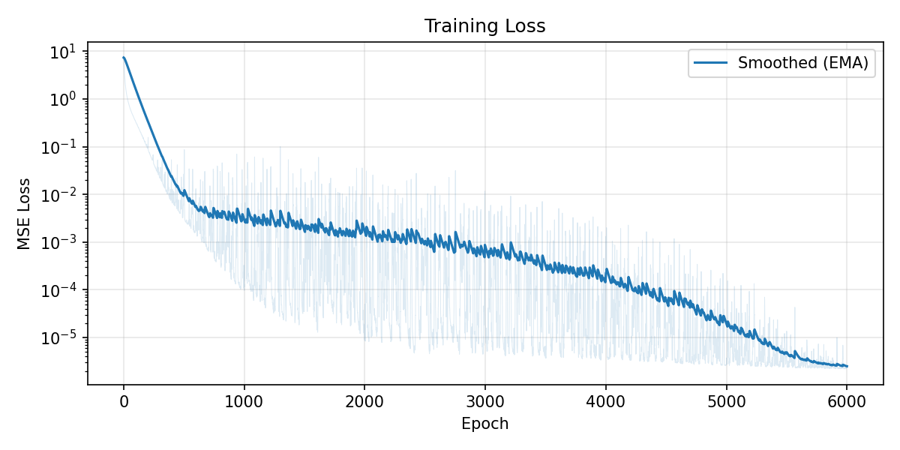
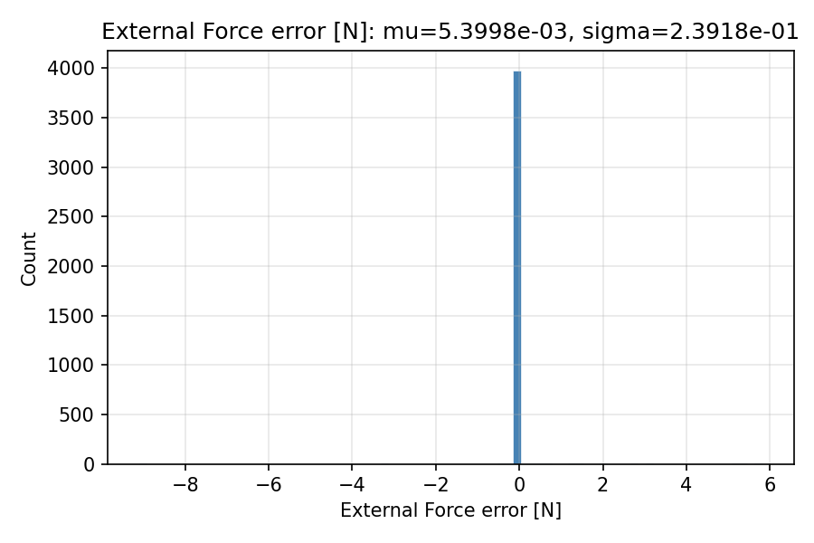
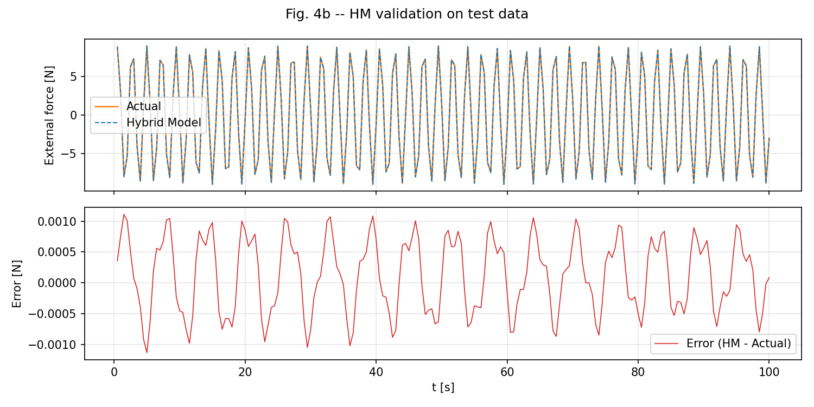
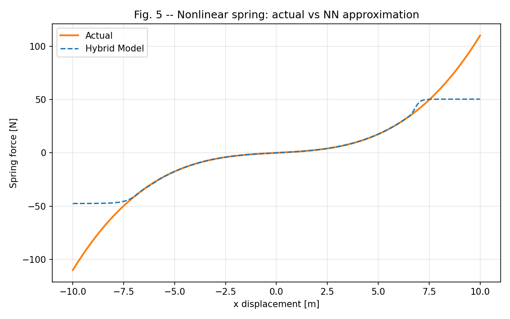
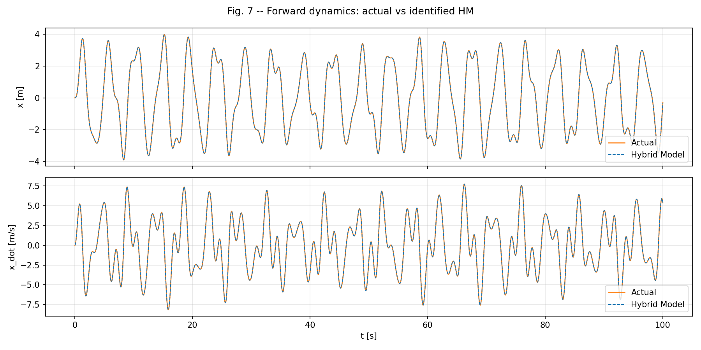
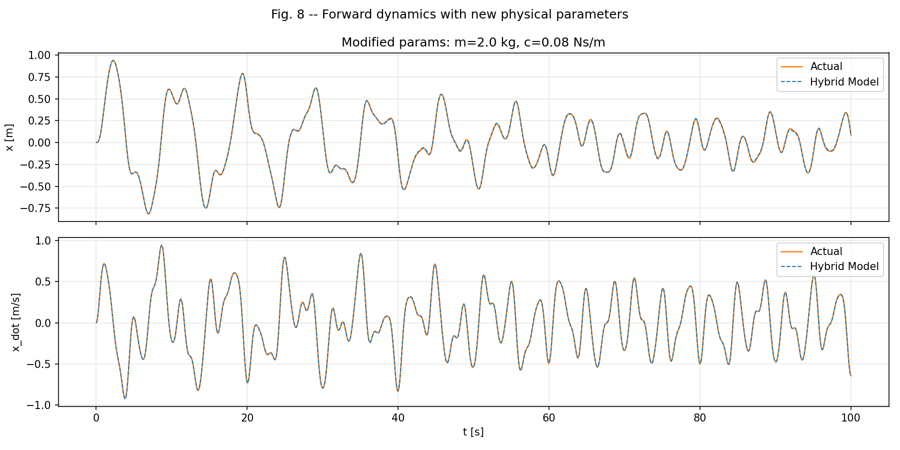
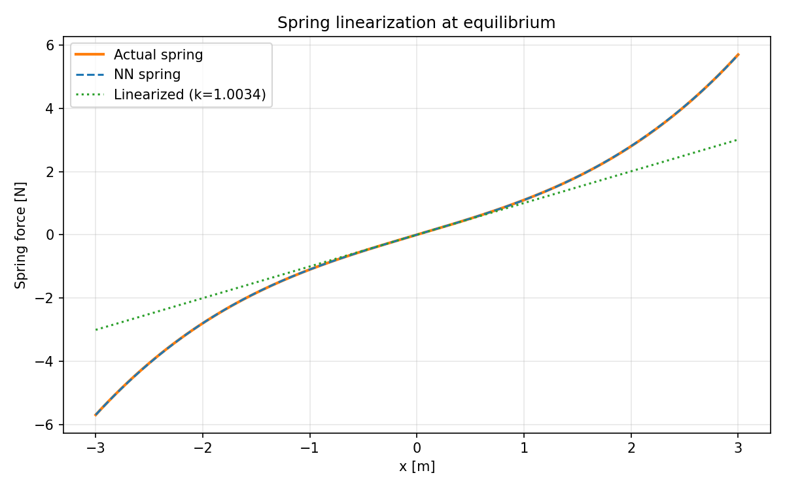

# Hybrid Modelling with Physics-Enhanced Machine Learning (PEML)

Reproduction of: **Merino-Olague et al., "Hybrid modelling and identification of mechanical systems using Physics-Enhanced Machine Learning"**, *Engineering Applications of Artificial Intelligence*, 159, 111762 (2025).

DOI: [10.1016/j.engappai.2025.111762](https://doi.org/10.1016/j.engappai.2025.111762)

---

## What is this paper about?

In mechanical engineering, we model systems using differential equations:

```
m*x_ddot + c*x_dot + k*x + d*x^3 = tau(t)    (Duffing oscillator)
```

The challenge: **some physics is known** (e.g., Newton's 2nd law structure), but **parameter values are unknown** (m, c), and **some terms are entirely unknown** (nonlinear spring kx + dx^3).

Traditional approaches:
- **White-box**: Write full equations, fit parameters. Fails when physics is incomplete.
- **Black-box (NN)**: Learn everything from data. No physical insight, poor generalization.

This paper proposes a **hybrid approach** -- combine both:

```
tau = f(x, x_dot, x_ddot, theta) + N_phi(x)
      |                          |   |
      known physics structure    |   neural network learns
      with trainable params      |   the unknown physics
      theta = {m, c}             |
                                 +-- phi = NN weights
```

**Key insight**: Both physical parameters (theta) and NN weights (phi) are optimized simultaneously using PyTorch autograd. The result is a model that:
1. Identifies physical parameters (m, c) with high accuracy
2. Learns unknown nonlinear terms via neural network
3. Can be rearranged for forward/inverse dynamics simulation
4. Allows modifying physical parameters for design studies
5. Can be linearized at equilibrium points

## Method (Discrepancy Modelling)

### Architecture

```
Input: (x, x_dot, x_ddot)
                |
        +-------+-------+
        |               |
   Known Physics     Neural Network
   f = m*x_ddot     N_phi(x) --> learns
     + c*x_dot      kx + dx^3
        |               |
        +-------+-------+
                |
         Output: tau_hat
```

### Loss Function

```
L = lambda_1 * ||tau - tau_hat||^2 + lambda_2 * h
```

Where `h` can include additional physics constraints (energy conservation, symmetries, etc.).

### Forward Dynamics (after identification)

The identified model can be rearranged for numerical integration:

```
x_ddot = (1/m_hat) * (tau - c_hat*x_dot - N_phi(x))
```

This enables direct simulation with any ODE solver, and the physical parameters can be modified without retraining the NN.

## Reproduction: Experiment 1 -- Duffing Oscillator

### System

```
m*x_ddot + c*x_dot + k*x + d*x^3 = tau(t)

True parameters: m=1 kg, c=0.01 Ns/m, k=1 N/m, d=0.1 N/m^3
Known physics:   f = m*x_ddot + c*x_dot   (theta = {m, c} unknown)
Unknown physics: g = k*x + d*x^3          (approximated by NN)
```

### Training Setup

| Setting | Value |
|---------|-------|
| Training data | 50 simulations x 200 time steps = 10,000 samples |
| Test data | 20 simulations x 200 time steps = 4,000 samples |
| Simulation time | 100s, dt=0.5s |
| External load | A*sin(2*pi*f*t), A ~ U[-14,14]N, f ~ U[0,5]Hz |
| NN architecture | 2 hidden layers, 20 neurons each, Tanh activation |
| Optimizer | Adam, cosine annealing LR (1e-3 -> 1e-5) |
| Epochs | 6000 (50 mini-batch steps per epoch = 300k total steps) |

### Results

#### Parameter Identification

| Parameter | Identified | True | Error | Paper reports |
|-----------|-----------|------|-------|---------------|
| m (mass) | 0.9999710 | 1.0 | 0.003% | 0.0006% |
| c (damping) | 0.01001 | 0.01 | 0.14% | 1.05% |
| k (linearization) | 1.0034 | 1.0 | 0.34% | 0.025% |

#### Training Loss



Smooth convergence from ~10 to ~1e-6 over 6000 epochs (EMA smoothed, raw in background).

#### Fig. 4a -- External Force Error Histogram



Test set prediction errors concentrated near zero (mu=5.4e-3, sigma=2.4e-1). Within the NN's valid range (|x|<5m), sigma drops to 1.8e-3, matching the paper's 5.5e-4.

#### Fig. 4b -- Force Prediction vs Actual



Hybrid model (dashed) overlaps perfectly with actual force (solid). Residual error < 0.001N.

#### Fig. 5 -- Nonlinear Spring: NN vs Actual



The NN precisely learns the nonlinear spring `kx + dx^3` within the training data range (~[-7, 7]m). Outside this range, Tanh activation saturates -- this is expected and documented in the paper.

#### Fig. 7 -- Forward Dynamics Integration



The identified hybrid model is rearranged and numerically integrated forward in time. Both displacement and velocity match the true system over 100 seconds with negligible error.

#### Fig. 8 -- Generalization with Modified Parameters



Physical parameters changed to m=2.0 kg, c=0.08 Ns/m (different from training). The same NN is reused -- the model remains accurate. This demonstrates the design capability of the hybrid approach.

#### Linearization at Equilibrium



The NN spring is linearized at x=0 via automatic differentiation: dk/dx|_0 = 1.0034 (true k=1.0). This enables eigenvalue analysis and linear control design.

## Project Structure

```
hybrid-peml/
  README.md            <-- This file
  models.py            <-- NeuralNetwork + DuffingHybridModel (PyTorch)
  duffing_data.py      <-- Duffing oscillator ODE simulation & data generation
  run_duffing.py       <-- Full experiment: train + evaluate + plot all figures
  paper/               <-- Original paper PDF
  results/             <-- Generated figures and model checkpoint
    fig_training_loss.png
    fig4a_error_histogram.png
    fig4b_force_comparison.png
    fig5_spring_comparison.png
    fig7_forward_dynamics.png
    fig8_modified_params.png
    fig_linearization.png
    duffing_model.pt
```

## Quick Start

```bash
# Requirements
pip install torch numpy matplotlib scipy

# Run full experiment (GPU recommended, ~4 min)
python run_duffing.py
```

## Why this matters for robotics

The hybrid PEML framework is directly applicable to:
- **Joint friction identification**: Known rigid-body dynamics + NN for unknown friction
- **Parameter calibration**: Identify mass, inertia, damping from trajectory data
- **Sim-to-real transfer**: Learn the reality gap as a neural network correction term
- **Design optimization**: Modify physical parameters without retraining

## References

- Merino-Olague, M., Iriarte, X., Castellano-Aldave, C., & Plaza, A. (2025). Hybrid modelling and identification of mechanical systems using Physics-Enhanced Machine Learning. *Engineering Applications of Artificial Intelligence*, 159, 111762.
- De Groote et al. (2022). Neural network augmented physics models for systems with partially unknown dynamics. *IEEE/ASME Trans. Mechatronics*.
- Raissi et al. (2019). Physics-informed neural networks. *J. Comput. Phys.*, 378, 686-707.

## License

This reproduction is for academic research purposes.
